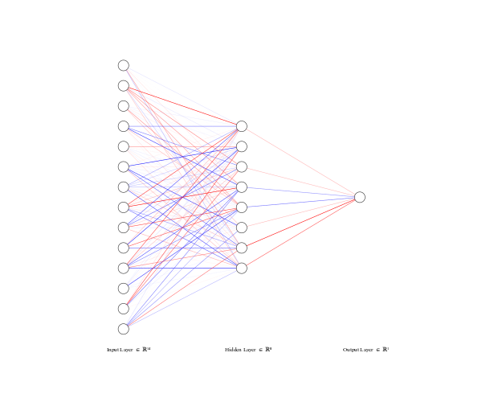

<div align="center">
 <br />

# Prediction model for Dutch House Prices Dataset


[Overview](#scroll-overview)
•
[Model](#chart_with_upwards_trend-model)
•
[Results](#closedbook-results)
</div>

## :bookmark_tabs: Menu

- [Overview](#scroll-overview)
- [Model](#chart_with_upwards_trend-model)
- [Results](#open_file_folder-folder-structure)
- [How to use](#clipboard-how-to-use)
- [Requirements](#exclamation-requirements)
- [Folder Structure](#closedbook-results)
- [Author](#smiley_cat-author)

## :scroll: Overview

This repository hosts multiple Jupyter Notebooks that analyse and train models on the [Dutch House Prices Dataset](https://www.kaggle.com/datasets/bryan2k19/dutch-house-prices-dataset). These models try to predict the price of a house, using the house characteristics. These characteristics consist of the size of the house, the city the house is in, what kind of roof or garden the house has and many more. Please inspect the dataset or follow the previous link to learn more about the data.

This repository is part of my House Price series in which we create a dataset, train a prediction model, and deploy the model and an accompanying web app.

## :chart_with_upwards_trend: Model

A linear deep learning model was used. We used multiple training strategies to find the best performing model. We used different loss functions, multiple learning rates, dropout, and varied the amount of training epochs. In the end, the best model turned out to be a 2-layer fully connected neural network. 

<div align="center">
 <br />
</div>

The model is deployed on Amazon Web Services (AWS). See [this](https://github.com/bryanlusse/HousePrices__DeployedModel) repository for that project and source code.

## :closed_book: Results

The best performing model consisted of 2 fully connected layers, and used a learning rate of 0.001. Metrics used for perfomance quantification were Mean Absolute Error (MAE), Mean Squared Error (MSE) and Root Mean Squared Error (RMSE).
Results of the best model for all metrics were as follows:


MAE | MSE | RMSE
---|---|---
134581.68 | 55822818451.05 | 236268.53

Where the MAE and RMSE are in euro's (€) and the MSE is in euro's squared (€$^2$)

## :clipboard: How To Use

Clone the repository by running the following command in terminal:

```console
$ git clone https://github.com/bryanlusse/HousePrices__DeployedModel.git
```

Or just download the zip file at the top of the page.

Change your working directory and set up a virtual environment, by creating it and installing all the requirements:

```console
$ cd web_scraper
$ python -m venv venv
$ pip install -r requirements.txt
```

Activate your virtual environment and start up Jupyter Notebook. Select the *data_processing.ipynb* or *house_price_prediction_pytorch.ipynb* file and you can code away and process the data or train your own models!

```console
$ source venv/bin/activate
$ jupyter notebook
```

## :exclamation: Requirements

Found in [requirements.txt](https://github.com/bryanlusse/HousePrices__NetworkTraining/blob/master/requirements.txt).


## :open_file_folder: Folder Structure

```
.
├── assets                                   # Images for notebook
├── raw_unmerged_data                        # Raw house price data
├── datasets                                 # Merged and processed house price data
├── data_processing.ipynb                    # Notebook for processing the raw data
├── house_price_prediction_pytorch.ipynb     # Main notebook using Pytorch
├── best_model_parameters                    # Folder containing parameters of best model
├── requirements.txt                         # Required packages
└── README.md
```

## :smiley_cat: Author

- [@bryanlusse](https://github.com/bryanlusse)

Made with &nbsp;❤️&nbsp;